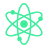

<div align="center">
    <h1>Atoms</h1>
    
    
    A typst ui library for computer science papers, research, and brainstorming :).
</div>


## Current Components (Beta - still potential to change)


- <a href="#Card">Card</a> (working on)
- [Button](#Buttons)
------

# Components


### Card (Currently Working on)
<div class="definition">

<p class="api"><strong>Config</strong>: <a href="https://typst.app/docs/reference/foundations/dictionary/">dictinary</a></p>

</div>

Example: 
```typst
#import "src/molecules/cards/example.typ": *

#let configExample = (
    header: (title: "foo", icon: emoji.hand),
    padding: 16pt,
    radius: 8pt,
    border: (width: 0.5pt, color: none, style: "solid"),
)

#card(config: configExample)[...]

```


-----


### Buttons

<div class="definition">

<p class="api"><strong>content</strong>: <a href="https://typst.app/docs/reference/foundations/dictionary/">dictinary</a></p>
<p class="api"><strong>variant</strong>: <a href="https://typst.app/docs/reference/foundations/str/">str</a></p>
<p class="api"><strong>size</strong>: <a href="https://typst.app/docs/reference/foundations/str/">str</a></p>
<p class="api"><strong>fill?</strong>: <a href="https://typst.app/docs/reference/visualize/color/">color</a></p>
<p class="api"><strong>stroke?</strong>: <a href="https://typst.app/docs/reference/visualize/color/">color</a></p>
<p class="api"><strong>text-color?</strong>: <a href="https://typst.app/docs/reference/visualize/color/">color</a></p>
<p class="api"><strong>radius?</strong>: <a href="https://typst.app/docs/reference/layout/length/">Length</a></p>
<p class="api"><strong>width?</strong>: <a href="https://typst.app/docs/reference/layout/length/">Length</a></p>
<p class="api"><strong>block?</strong>: <a href=""></a></p>
</div>

Example:
```typst
#import "src/molecules/buttons/basic.typ": *

#basicButton(
    [foo],
    variant: "secondary",
    bg-color: rgb("#000000"),
    stroke: 0.5pt + rgb("#ff0000"),
    text-color: rgb("#00ff00"),
    radius: 8pt,
    width: 100%,
)
```


